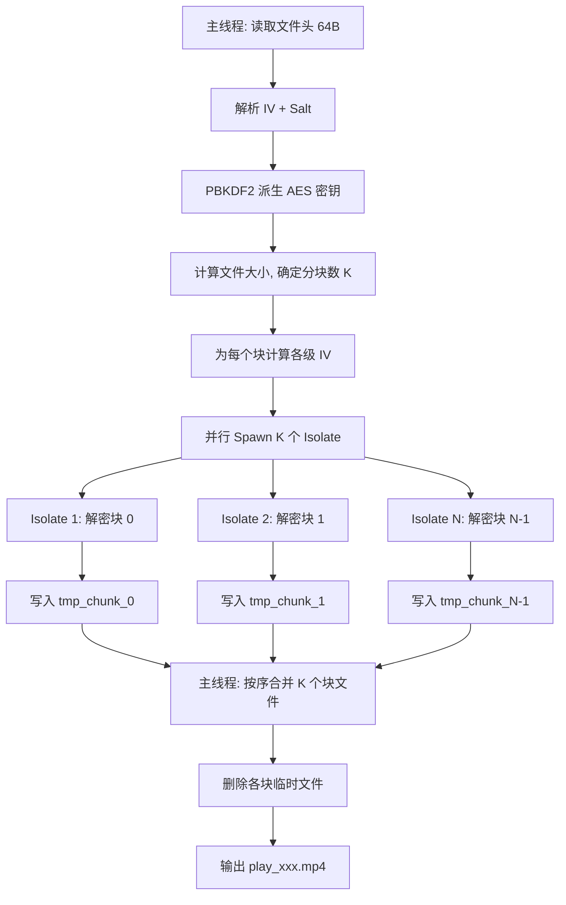

## 用户需求

审查并优化视频全量解密播放的解压速率。当前流程是完整解密到临时文件后再播放，瓶颈集中在单 Isolate 串行解密 + 512KB 小缓冲区 + 零覆写安全删除。

## 产品概述

SnPlayer 加密视频播放器，支持 AES-256-CTR 加密的 .enc 视频文件的解密播放。

## 核心优化点

1. **缓冲区扩容**：512KB → 4MB，减少系统调用次数，提升 I/O 吞吐
2. **跳过临时文件零覆写**：播放临时文件解密后无需安全擦除，普通 delete 即可
3. **多 Isolate 并行分块解密**：利用 CTR 模式天然支持随机访问的特性，将文件切分为 2~4 块，各块在不同 Isolate 中并行解密，最后合并输出。预期解密速度提升 2-4 倍

## 技术栈

- **语言**：Dart (Flutter)
- **加密库**：PointyCastle (CTRStreamCipher + AESEngine)
- **并发**：Dart Isolate + SendPort/ReceivePort 双向通信
- **文件 I/O**：dart:io RandomAccessFile + File.openWrite

## 实现方案

### 核心思路

利用 AES-CTR 模式的随机访问特性：第 N 个 16 字节块的解密仅依赖初始 IV 值 + 块序号 N。PointyCastle 的 `CTRStreamCipher` 将 16 字节 IV 整体视为 big-endian 整数，每处理一个块就递增 1。因此，若文件被切分为 K 块，第 k 块起始偏移为 `offset_k` 字节，则其对应的 IV 为 `initial_iv + (offset_k / 16)`（big-endian 加法）。每个块可在独立 Isolate 中独立解密，最后按序拼接。

### 并行解密流水线



### 分块策略

- 文件小于 64MB：单 Isolate（不切分，避免小文件并行开销）
- 文件 64MB~256MB：2 个 Isolate
- 文件大于 256MB：4 个 Isolate（上限，避免过多 Isolate 竞争磁盘 I/O）
- 每个 Isolate 内部仍使用双缓冲流水线（缓冲区统一 4MB）

### Merge 阶段

按块序号顺序，依次读取各 `tmp_chunk_N` 文件并追加写入最终输出文件。Merge 是纯 I/O 操作（无 CPU 加解密），速度极快。

### 代码设计原则

- **向后兼容**：加密路径（encryptFile）和部分解密（decryptPartial）保持不变
- **失败回退**：并行解密任意 Isolate 失败时，整个操作标记失败，清理已生成的块文件
- **Isolate 超时**：单块超时沿用 5 分钟限制；并行批量超时 = max(各块耗时) + merge 时间
- **重用现有基础设施**：cryptoWorker 命令分发模式、密钥缓存、progressPort 进度回传

## 实现细节

### 目录结构

```
SnPlayer/
├── lib/
│   ├── config/
│   │   └── crypto.dart                  # [MODIFY] 常量调整
│   ├── utils/
│   │   └── crypto_utils.dart            # [MODIFY] 新增 incrementCounter()
│   ├── services/
│   │   ├── crypto_isolate.dart          # [MODIFY] 新增 chunk decrypt worker + processChunk()
│   │   ├── crypto_service.dart          # [MODIFY] 新增 _runParallelDecrypt() + _mergeChunks()
│   │   └── safe_delete_helper.dart      # [MODIFY] 新增 fastDelete()
│   └── screens/
│       └── video_player_screen.dart     # [MODIFY] safeDelete → fastDelete
```

### 关键文件修改说明

#### 1. `lib/config/crypto.dart` — 常量调整

- `bufferSize`: `512 * 1024` → `4 * 1024 * 1024` (4MB)
- 新增：
- `parallelDecryptMinFileSize = 64 * 1024 * 1024` — 低于此值不并行
- `parallelDecryptMaxIsolates = 4` — 最大并行 Isolate 数
- `parallelDecryptMidFileSize = 256 * 1024 * 1024` — 分档阈值

#### 2. `lib/utils/crypto_utils.dart` — 新增 IV 递增工具

- 新增 `static Uint8List incrementCounter(Uint8List iv, int increment)`
- 将 16 字节 IV 解释为 big-endian 整数
- 加上 increment 后返回新的 16 字节 big-endian 表示
- 无溢出检查（CTR 模式 counter 溢出在视频文件中不会发生）

#### 3. `lib/services/crypto_isolate.dart` — 并行解密 Worker

- 新增 worker 命令 `'decrypt_chunk'`：
- 参数：`inputPath` + `outputPath`（块临时文件）+ `startOffset` + `chunkLength` + `adjustedIv` + `key`
- 流程：打开输入文件 → seek 到 startOffset → 以 adjustedIv 创建 cipher → 双缓冲解密 chunkLength 字节 → 写入输出
- 新增 `_decryptChunkInIsolate()` 函数：
- 复用现有 `_processFile()` 的双缓冲模式，但直接操作指定偏移和长度
- 不写文件头（headerBuilder: null）
- 参数化 buffer size 便于测试

#### 4. `lib/services/crypto_service.dart` — 并行解密服务层

- 修改 `decryptToTemp()`：检测文件大小，决定是否使用并行路径
- 新增 `_runParallelDecrypt()`：

1. 读取文件头获取 IV + Salt
2. 推导密钥（命中缓存则跳过 PBKDF2）
3. 计算文件大小、确定分块数和每块边界
4. 为每个块计算 adjustedIv = incrementCounter(iv, startOffset ~/ 16)
5. 并行 spawn Isolate 执行各块解密
6. 收集进度（按块大小加权聚合）
7. 所有块完成后 merge

- 新增 `_mergeChunks()`：
- 按序用 `File.openWrite(mode: FileMode.writeOnlyAppend)` 追加各块到最终文件
- merge 完成后删除各临时块文件

#### 5. `lib/services/safe_delete_helper.dart` — 快速删除

- 新增 `static Future<bool> fastDelete(String filePath)`：
- 直接 `await file.delete()` + 验证
- 失败时 3 次简单重试（间隔 100ms/500ms/1s），不复写
- 用于播放临时文件、块临时文件等非敏感临时数据

#### 6. `lib/screens/video_player_screen.dart` — 改用快速删除

- `_safeDeleteTempFile()` 中 `SafeDeleteHelper.safeDelete(path)` → `SafeDeleteHelper.fastDelete(path)`
- 移除 30 秒延迟删除 Timer（播放过程中即可删除，因为 `video_player` 已打开文件句柄，Linux/Android 上删除已打开文件不会影响读取）
- **保留 dispose 时的清理**：退出页面时立即 fastDelete

### 性能预期

| 优化项 | 预期提升 |
| --- | --- |
| 512KB→4MB 缓冲区 | 减少系统调用 ~87.5%，I/O 吞吐提升 30-50% |
| 跳过零覆写 | 消除临时文件的第二次完整写入，省去 ~100% 额外 I/O |
| 并行分块解密 (4 Isolates) | CPU 利用率从 ~25% 提升至 ~100%（4 核设备），解密耗时降至 1/3~1/4 |
| 综合 | 2GB 视频解密耗时从 ~60s 降至 ~15-20s（4 核设备） |


### 风险与回退

- **小文件不并行**：<64MB 文件直接用原单 Isolate 路径，避免 Isolate 启动开销 > 并行收益
- **磁盘碎片**：块临时文件使用 `play_cache/chunks/` 子目录，与播放缓存隔离
- **失败清理**：finally 块确保任意步骤失败时清理所有已生成的块文件
- **进度一致性**：merge 阶段无进度回调，进度值在 0~95% 之间（解密阶段），merge 完成直接跳到 100%