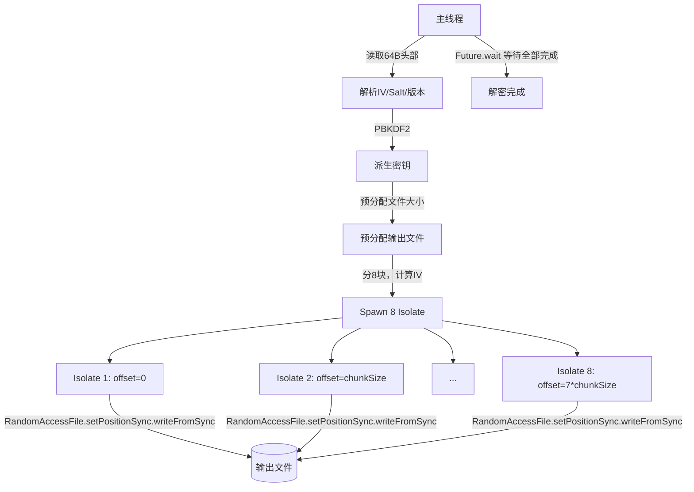

## 产品概览

优化 SnPlayer 大文件（>64MB）并行解密播放速度，解决 836MB 文件 20 秒解密 + 2 秒合并的性能瓶颈。

## 核心功能

1. **增加 8 Isolate 并行档位**：密文数据 >512MB 时启用 8 路并行解密，充分利用现代手机 8 核 CPU，理论吞吐翻倍
2. **取消合并阶段**：Isolate 直接通过 `RandomAccessFile` 写入输出文件正确偏移位置，消除"写临时文件 → 读临时文件 → 写输出"的 3 次磁盘 I/O
3. **删除临时目录逻辑**：移除 `_mergeChunks` 方法和 `chunksDir` 目录创建/清理代码

## 技术栈

- 语言：Dart（Flutter）
- 加密库：pointycastle（AES-256-CTR）
- 并发：dart:isolate（Isolate.spawn + SendPort/ReceivePort）
- I/O：dart:io（RandomAccessFile, FileMode）

## 实现方案

### 方案概述

三层优化叠加：增加并行度（8 核） + 取消合并 I/O（直接写入） + 删除冗余逻辑（_mergeChunks）。改动涉及 3 个文件，约 40 行净增 / 50 行净删，架构影响集中在并行解密调度链。

### 关键技术决策

**1. 8 Isolate 为何安全有效**

836MB 文件分 8 块 ≈ 104MB/块。现代 Android 设备普遍 8 核（1+3+4 或 4+4 架构），8 Isolate 可以跑满所有核心。每个 Isolate 约 104MB 数据量在内存中可控（4MB 双缓冲 × 2 = 8MB 峰值内存/Isolate，8 个共约 64MB，完全在移动设备可用范围内）。

**2. 直接写入输出文件的实现方式**

- 主线程先用 `FileMode.write` 打开输出文件，`setPositionSync(totalSize - 1)` + `writeByteSync(0)` 预分配文件大小后关闭
- 每个 Isolate 通过 `File.open(mode: FileMode.writeOnlyAppend)` 获取 `RandomAccessFile`，再 `setPositionSync(writeOffset)` 定位到正确偏移，使用 `writeFromSync` 写入解密数据
- Android 底层 `FileMode.writeOnlyAppend` 对应 `O_WRONLY|O_CREAT|O_APPEND`，配合 `RandomAccessFile.setPositionSync` 内部使用 `pwrite()` 系统调用，支持随机位置写入且多句柄写不同区域无竞争
- 预分配保证文件大小正确，各 Isolate 写入不重叠区域，无需锁或同步

**3. 为何删除 _mergeChunks 而非保留**

合并阶段对 836MB 文件产生额外的 836MB 读取 + 836MB 写入 = ~1.6GB 磁盘 I/O。直接写入将 I/O 总量从 3 次（写临时 + 读临时 + 写输出）降至 1 次（直接写输出），节省约 2/3 磁盘带宽。

### 架构设计



## 修改文件清单（3 个文件）

### `lib/config/crypto.dart` — 新增 2 个常量

在现有 `parallelDecryptMaxIsolates = 4` 之后新增：

- `parallelDecryptLargeFileSize = 512 * 1024 * 1024` — 大文件阈值
- `parallelDecryptLargeIsolates = 8` — 大文件 8 路并行

### `lib/services/crypto_service.dart` — 4 处修改

1. **`_getChunkCount()`**：增加 `>512MB → 8` 分支
2. **`decryptFileParallel()`**：移除 `chunksDir` 创建和 finally 清理逻辑，`_runParallelDecrypt` 不再传 `chunksDir`
3. **`_runParallelDecrypt()`**：

- 移除 `chunksDir` 参数
- 派生密钥后预分配输出文件
- `_spawnChunkIsolate` 改为传 `outputPath` + 各块 `writeOffset`（= 块序号 × chunkSize），不再生成临时路径
- 移除 `Future.wait` 之后的 `_mergeChunks` 调用和 `chunkPaths` 变量

4. **删除 `_mergeChunks()`** 方法（~25 行）

### `lib/services/crypto_isolate.dart` — 2 处修改

1. **`cryptoWorker()`** 中的 `decrypt_chunk` 分支：从 message 读取新增的 `writeOffset` 参数
2. **`_decryptChunkInIsolate()`**：

- 新增 `writeOffset` 参数
- 输出从 `File(outputPath).openWrite(IOSink)` 改为 `File.open(mode: FileMode.writeOnlyAppend)` → `RandomAccessFile`
- `output.add()` 改为 `outputRaf.setPositionSync(writeOffset + 累计写入量)` → `outputRaf.writeFromSync()`

## 关键代码结构

### _decryptChunkInIsolate 签名单变更

```
// 改前
Future<void> _decryptChunkInIsolate({
  required String inputPath,
  required String outputPath,        // 临时块文件路径
  required int startOffset,
  required int chunkLength,
  ...
});

// 改后
Future<void> _decryptChunkInIsolate({
  required String inputPath,
  required String outputPath,        // 最终输出文件路径（同一个）
  required int startOffset,          // 密文起始偏移
  required int chunkLength,
  required int writeOffset,          // 输出写入偏移（新增）
  ...
});
```

### _spawnChunkIsolate message 变更

```
// 改前
workerSendPort.send({
  'command': 'decrypt_chunk',
  'outputPath': chunkPath,           // chunks/chunk_0.tmp
  ...
});

// 改后
workerSendPort.send({
  'command': 'decrypt_chunk',
  'outputPath': outputPath,          // play_xxx.mp4（最终输出）
  'writeOffset': writeOffset,        // 新增
  ...
});
```