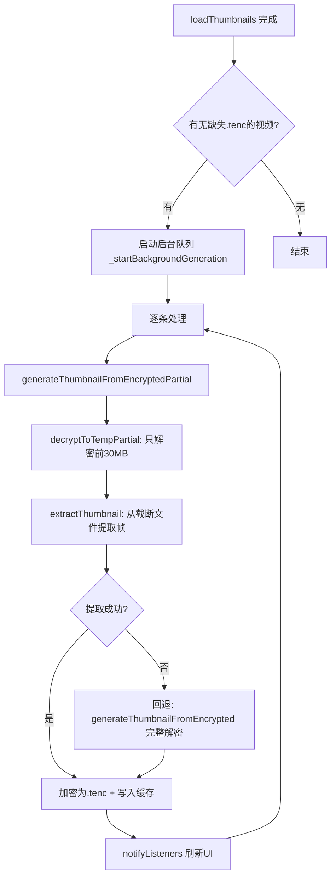

## 用户需求

将缩略图生成从"完整解密整个视频"改为"部分解密前30MB + 截断提取"方案，解决多视频/大文件场景下初始化极慢的问题，同时提升缩略图画面质量。

## 核心功能

- **部分解密**：仅解密加密视频的前30MB数据到临时文件，不再完整解密整个视频（几GB→30MB，速度提升100-500倍）
- **截断提取**：对截断的临时MP4文件使用 video_thumbnail 插件提取缩略图帧
- **提高画质**：缩略图分辨率从280x158提升至480x270，JPEG质量从90提升至95
- **保留回退**：保留原完整解密方法作为部分解密失败时的兜底方案
- **后台队列**：继续使用后台逐条生成队列，不阻塞UI交互

## 技术栈

- **语言**：Dart（Flutter）
- **加密**：PointyCastle（AES-256-CTR 流加密，支持任意位置解密）
- **缩略图提取**：video_thumbnail 插件（底层调用 MediaMetadataRetriever / AVAssetImageGenerator）
- **进程隔离**：Dart Isolate（加解密在后台线程执行）

## 实现方案

### 核心思路

AES-256-CTR 是流密码，解密第 N 个字节只需将计数器推进到对应位置。当前 `_processFile` 处理完整个文件后才停止，只需增加 `maxBytes` 参数，读取达到上限后提前终止循环即可。



### 关键技术决策

**1. 部分解密命名隔离**

- 完整解密临时文件：`play_{fileName}.mp4`（播放专用）
- 部分解密临时文件：`thumb_partial_{videoId}.mp4`（缩略图专用）
- 两个路径互不干扰，避免播放缓存被截断文件覆盖

**2. maxBytes 参数设计**

- 在 `_processFile` 中增加 `int? maxBytes` 可选参数
- 达到上限后立即跳出循环、flush 输出并返回
- 不影响原有加密/完整解密逻辑（maxBytes 为 null 时行为不变）

**3. Isolate 命令扩展**

- 新增 `decrypt_partial` 命令，携带 `maxBytes` 参数
- 复用现有 `cryptoWorker` → `_decryptFileInIsolate` 的通信模式
- `_runPartialInIsolate` 与 `_runInIsolate` 共享 Isolate 生命周期管理模式

**4. 回退策略**

- `generateThumbnailFromEncryptedPartial` 内 try-catch，失败时调用原 `generateThumbnailFromEncrypted`
- 覆盖少数不兼容格式（如 moov atom 在文件末尾的 MP4）

**5. 画质提升**

- 分辨率 480x270（约4倍于原280x158的像素量）
- JPEG 质量 95（几乎无损），文件大小约30-80KB，在可接受范围

## 实现细节

### 性能分析

- 完整解密 3GB 视频：约 60-120 秒（取决于设备I/O性能）
- 部分解密 30MB：约 0.5-1 秒
- 速度提升：100-500 倍
- 50 个视频场景：从数小时降至 1-2 分钟

### 边界情况处理

- `.tenc 已存在`：直接走 decryptThumbnailToCache，不受影响
- `部分解密提取失败`：自动回退到完整解密方法
- `加密文件小于30MB`：正常解密全部数据，不做截断
- `Isolate 崩溃`：复用现有 try-catch + cancel 机制

### 日志规范

- 沿用现有 `debugPrint('[SnPlayer] ...')` 格式
- 部分解密成功/失败均记录，失败时标注回退行为

## 目录结构

```
lib/
├── config/
│   └── crypto.dart                    # [MODIFY] 提升 thumbnailWidth/Height/Quality 常量，新增 partialDecryptMaxBytes
├── services/
│   ├── crypto_isolate.dart            # [MODIFY] _processFile 增加 maxBytes 参数；新增 _decryptFilePartialInIsolate；cryptoWorker 增加 decrypt_partial 分支
│   ├── crypto_service.dart            # [MODIFY] 新增 decryptToTempPartial() 和 _runPartialInIsolate()
│   └── thumbnail_service.dart         # [MODIFY] 新增 generateThumbnailFromEncryptedPartial()，保留原方法
└── providers/
    └── video_list_provider.dart       # [MODIFY] _startBackgroundGeneration 改用 generateThumbnailFromEncryptedPartial
```