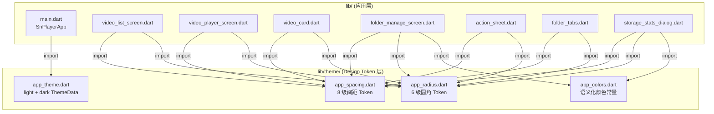

## 用户需求

对 SnPlayer Flutter 项目执行全面的样式重构，分为两大目标：

### 目标一：修复所有样式违规

基于 Codex UI Style Guide 审查报告中的 92 处违规，逐项修复：

- 硬编码颜色值 13 处 → 统一使用 `Theme.of(context).colorScheme` 或语义化常量
- 硬编码 BorderRadius 15 处 → 统一使用 Design Token 常量
- 硬编码 spacing/padding 37 处 → 统一使用间距 Token
- 硬编码 font-size 7 处 → 统一使用 `Theme.of(context).textTheme` 
- boxShadow 用于视觉分层 3 处 → 改用 `border` 实现分层
- 硬编码 icon size 12 处 → 使用 Token 常量或标准化尺寸
- 硬编码 font-weight 9 处 → 统一使用 Theme textTheme 中已设定的 weight

### 目标二：更换整体视觉风格

从当前暗色主题切换为**现代简约风（Modern Minimal）**：

- 浅色系为主（slate 灰白底 `#F8FAFC`），卡片轻微阴影营造层次
- indigo 蓝紫主色调（`#4F46E5`）作为品牌色，柔和典雅
- 更圆润的卡片（圆角从 12px 提升到 14-16px）
- 使用 `border` 而非 `boxShadow` 做组件分层
- 播放器页面保留黑色背景（功能性需求，但控件颜色 token 化）

## 技术栈

- Flutter 3.1+ / Dart
- 状态管理：Provider
- Material Design 3（`useMaterial3: true`）
- 无新增第三方依赖

## 实现方案

### 核心策略：Design Token 体系 + 逐文件替换

**分两层进行**：

1. **基础设施层** — 新建 `lib/theme/` 目录，提供 4 个 Token 文件，所有 8 个业务文件通过 `import` 引用
2. **替换执行层** — 逐文件将所有硬编码值替换为 Token 引用或 `colorScheme` / `textTheme` 引用

### 架构设计



### 设计 Token 详细定义

**app_spacing.dart** — 8 级间距：

| Token | 值 | 用途 |
| --- | --- | --- |
| `AppSpacing.xs` | 4.0 | 图标紧贴间距 |
| `AppSpacing.sm` | 6.0 | 超紧凑间距 |
| `AppSpacing.md` | 8.0 | 默认小块间距 |
| `AppSpacing.lg` | 12.0 | 网格/卡片内边距 |
| `AppSpacing.xl` | 16.0 | 标准段落间距 |
| `AppSpacing.xxl` | 20.0 | 大块间距 |
| `AppSpacing.xxxl` | 24.0 | 区域间距 |
| `AppSpacing.huge` | 32.0 | 页面级间距 |


**app_radius.dart** — 6 级圆角：

| Token | 值 | 用途 |
| --- | --- | --- |
| `AppRadius.xs` | 4.0 | 标签/徽章 |
| `AppRadius.sm` | 6.0 | 小卡片 |
| `AppRadius.md` | 8.0 | 图标容器/输入框 |
| `AppRadius.lg` | 12.0 | 标准卡片 |
| `AppRadius.xl` | 14.0 | 大卡片（新风格主打） |
| `AppRadius.xxl` | 20.0 | 弹窗/Sheet 圆角 |
| `AppRadius.full` | 9999.0 | 胶囊/药丸形状 |


**app_colors.dart** — 语义化常量（用于非 theme 的固定色）：

- `AppColors.success` = `Color(0xFF16A34A)` — 成功绿
- `AppColors.warning` = `Color(0xFFF59E0B)` — 警告黄
- `AppColors.presetFolderColors` — 文件夹预设颜色列表，从 folder_manage_screen 迁移过来

**app_theme.dart** — 双主题 ThemeData：

- **Light Theme**：`ColorScheme.fromSeed(seedColor: 0xFF4F46E5, brightness: Brightness.light)`，scaffoldBackgroundColor 使用 `Color(0xFFF8FAFC)`（slate-50），Card 使用 `elevation: 0` + `shape` 圆角 `14`，AppBar 无 elevation
- **Dark Theme**：同样 seedColor 但 brightness: Brightness.dark，保持暗色可用性

### 文件变更清单

```
lib/
├── theme/                              # [NEW] Design Token 目录
│   ├── app_spacing.dart                # [NEW] 8 级间距常量类
│   ├── app_radius.dart                 # [NEW] 6 级圆角常量类
│   └── app_theme.dart                  # [NEW] 统一 ThemeData（含 colors 和深色主题）
├── main.dart                           # [MODIFY] 替换 ThemeData 配置，引入 app_theme
├── screens/
│   ├── video_list_screen.dart          # [MODIFY] 39 处硬编码替换
│   ├── video_player_screen.dart        # [MODIFY] 15 处硬编码替换
│   └── folder_manage_screen.dart       # [MODIFY] 23 处硬编码替换
└── widgets/
    ├── video_card.dart                 # [MODIFY] 18 处硬编码替换
    ├── action_sheet.dart               # [MODIFY] 12 处硬编码替换
    ├── folder_tabs.dart                # [MODIFY] 10 处硬编码替换
    └── storage_stats_dialog.dart       # [MODIFY] 12 处硬编码替换
```

### 关键技术决策

1. **为什么不把 color_scheme 色值提取到独立文件？** — Flutter 的 `ColorScheme` 已经提供了完整的颜色语义体系（primary/secondary/tertiary/surface/error 等），业务代码应直接使用 `colorScheme.xxx`，无需再映射一层。只有**非 ColorScheme 的固定颜色**（如统计状态绿/黄、文件夹预设色）才放入 `app_colors.dart`。

2. **boxShadow → border 策略**：`video_list_screen` 底部状态栏的 `BoxShadow` 和 `folder_manage_screen` 色块选中的 `boxShadow` 均改为 `border: 1px solid colorScheme.outlineVariant`。浅色主题下 border 足够清晰，且更简约。

3. **播放器页面处理**：`video_player_screen.dart` 的 `Scaffold backgroundColor` 保留 `Colors.black`（这是视频播放的标准 UX 约定），但 AppBar 背景色从 `Colors.black54` 改为 `colorScheme.surface.withOpacity(0.8)`，进度条/文字颜色改用 `colorScheme.onSurface`。

4. **间距 Token 使用策略**：使用静态常量类（`class AppSpacing { static const double xs = 4.0; }`）而非 ThemeExtension，因为间距本身不随主题变化，避免不必要的 context 依赖。

5. **深色主题保留**：虽然主推浅色，但保留 `darkTheme` 配置，通过 `themeMode: ThemeMode.system` 让系统根据用户偏好自动切换。

## 设计风格：现代简约（Modern Minimal）

### 设计理念

以「少即是多」为原则，通过留白、柔和阴影、克制配色营造干净、优雅的视频管理体验。

### 配色方案

- **主色调**：Indigo 蓝紫 `#4F46E5`，传达专业与信任感
- **背景色**：Slate 灰白 `#F8FAFC`（light）/ `#0F172A`（dark），降低视觉疲劳
- **表面色**：纯白 `#FFFFFF`（light）/ Slate-800 `#1E293B`（dark），卡片层次清晰
- **强调色**：翠绿 `#16A34A`（成功/导出）、琥珀 `#F59E0B`（缓存/警告）

### 页面设计

#### 视频列表页（主页面）

- **顶部导航栏**：无底部分隔线，标题 22px bold，右侧图标按钮 20px 紧凑排列
- **文件夹标签栏**：48px 高度横向滚动，选中标签 indigo 背景+白色文字，未选中透明底+slate 文字，胶囊形状（圆角 9999）
- **视频卡片网格**：2 列布局，间距 8px，卡片圆角 14px，白色底+极淡阴影（elevation 0，靠 border 分层），缩略图 16:9 比例，底部信息区内边距 8px
- **底部状态栏**：圆角 16px 白色面板，margin 16px，内边距 horizontal 16/vertical 10，左侧图标+「N 个加密视频·XX MB」统计文字，**无阴影**改用 `border: 1px solid outlineVariant`
- **FAB 按钮**：圆角 16px extend 样式，indigo 底色+"选择视频加密"文字
- **空状态**：居中灰色图标 64px + 引导文字

#### 视频播放页

- **背景**：纯黑 `#000000`（功能性需求不可改）
- **顶部导航栏**：半透明 slate-900 背景，白色前景，无 elevation
- **加载/错误状态**：白色/浅灰文字居中显示
- **播放覆盖层**：64px 黑色半透明圆形播放按钮，进度条使用白色+半透明材质
- **时间标签**：白色 12px 文字，底部边距 8px

#### 文件夹管理页（BottomSheet）

- **顶部拖拽条**：32x4px 灰色圆角条
- **文件夹行卡片**：圆角 12px，左侧 36px 彩色图标区域，右侧 PopupMenu
- **创建文件夹弹窗**：预设 8 色色块 32px 圆形，选中态用 **border 高亮**（白色 border 2.5px）+ 轻微外扩背景光晕，不启用 boxShadow
- **颜色选择器**：44px 圆形色块，选中态同样用 border 而非 boxShadow

#### 操作菜单（ActionSheet）

- 圆角 20px 顶部
- 菜单项：左侧 40px 彩色圆角图标容器，右侧文字
- 取消按钮：outlined 样式，圆角 12px，全宽

#### 存储统计弹窗

- 顶部标题行：图标+文字
- 三个统计行：36px 彩色图标容器，左侧文字+数量，右侧文件大小
- 底部总计行：Divider 分隔 + 加粗统计
- 状态图标颜色引用 ColorScheme（主色/tertiary）

### 字体系统

- 标题：系统默认 sans-serif，22px / bold / letterSpacing -0.5
- 卡片标题：14px / medium
- 正文：14px / regular
- 辅助文字：12px / regular
- 标签/徽章：10px / bold / 大写

### 交互规范

- 卡片 hover/active：背景微变，无 elevation 动效
- 按钮 hover：opacity 0.9
- 标签切换：0.15s 背景色渐变过渡
- 弹窗进入：底部滑入（Material 默认）

## 使用的技能

### Skill

- **codex-ui-style-guide**
- 用途：作为样式审查基准，在实现完成后对重构结果进行二次审查，验证所有违规是否已修复
- 期望结果：审查报告显示 0 处高/中优先级违规，硬编码值全部替换为 Token 或 theme 引用