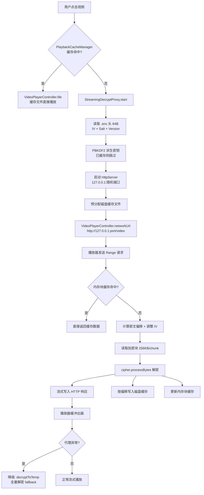

## 用户需求

当前视频播放采用全量解密后播放的策略（`CryptoService.decryptToTemp()` → `VideoPlayerController.file()`），大文件解密耗时长、起播慢。此前尝试过边解边播方案但因临时文件增长、自定义数据源复杂等问题未果。

## 产品概述

将"全量解密→文件播放"管线替换为"本地HTTP代理→按需分块解密→流式播放"管线。利用 AES-256-CTR 的随机访问特性和原生播放器的 HTTP Range 支持，实现秒级起播、按需解密、内存块缓存和磁盘缓存回放。

## 核心功能

- **本地 HTTP 代理服务器**：启动轻量 HttpServer 监听 127.0.0.1，接收播放器的 Range 请求，按需解密对应区间并流式返回
- **分块流式解密**：利用 CTR 模式的 `incrementCounter()` 实现任意偏移 O(1) 解密，256KB 处理块 + 事件循环让步，不阻塞 UI
- **快速起播**：播放器首请求仅需 PBKDF2 密钥派生（~100ms，已缓存）+ 首块解密（~10ms），200-500ms 内出画
- **内存块缓存**：LRU 缓存已解密的 4MB 数据块（上限 64MB），避免 seek 回退时重复解密
- **磁盘缓存回放**：代理流式写入解密数据到 `play_cache/` 缓存文件，二次播放同一视频时直接从缓存文件加载，零解密等待
- **安全降级**：代理启动失败或异常时自动回退到现有全量解密路径，零回归风险

## Tech Stack

- **加密核心**：复用现有 PointyCastle AES-256-CTR + `CryptoUtils.incrementCounter()` 随机访问
- **HTTP 服务器**：`dart:io HttpServer`（零新依赖，项目已大量使用 dart:io）
- **视频播放**：复用 `video_player ^2.8.0` 的 `VideoPlayerController.networkUrl()` 构造器
- **平台支持**：Android ExoPlayer / iOS AVPlayer 均原生支持 HTTP + Range 请求，无需写平台特定代码
- **Android 网络配置**：新增 `network_security_config.xml` 允许 127.0.0.1 明文 HTTP 流量

## Implementation Approach

### 核心策略：本地 HTTP 代理 + 按需 Range 解密

不修改播放器、不写原生代码、不依赖文件增长。利用 `video_player` 的 `networkUrl()` 构造器 + 原生播放器内置 HTTP Range 支持，在本地启动 HTTP 代理服务器，将 Range 请求映射为加密文件的对应区间解密。

**工作原理**：

1. 用户点击视频 → 代理读取 .enc 文件头 64 字节获取 IV/Salt → PBKDF2 派生密钥（已缓存）
2. 启动 HttpServer 监听 127.0.0.1:{随机端口}
3. `VideoPlayerController.networkUrl('http://127.0.0.1:{port}/video')` 初始化播放器
4. 播放器发送 `Range: bytes=start-end` → 代理计算密文偏移 + 调整 IV → 仅解密请求区间 → 流式返回
5. 代理同时将解密数据写入磁盘缓存文件，二次播放直接从文件加载

**为什么此方案不同于之前失败的"边解边播"**：

- 不使用不断增长的临时文件（播放器在 init 时读取文件大小，后续追加不可见）
- 不需要自定义 DataSource（平台特定，复杂易错）
- 不需要管道喂数据（video_player 不支持自定义数据源注入）
- 播放器看到的是标准 HTTP 源，Content-Length 完整，Accept-Ranges 支持，seek 即时响应

### 关键技术决策

| 决策 | 选择 | 理由 |
| --- | --- | --- |
| HTTP 框架 | `dart:io HttpServer` | 零新依赖，项目已大量使用 dart:io，完整控制 Range 解析和流式响应 |
| 解密执行位置 | 主 Isolate + 256KB 块让步 | 避免 Isolate 通信开销；256KB 块约 5-25ms，配合 `Future.delayed(Duration.zero)` 让步防 UI 阻塞 |
| 块对齐处理 | 向下对齐到 16 字节边界 + 跳过多余字节 | CTR 模式 16 字节块对齐要求；`aligned_start = (range_start ~/ 16) * 16`，跳过 `range_start - aligned_start` 字节 |
| 内存缓存粒度 | 4MB 块 LRU，上限 16 块（64MB） | 与现有 `bufferSize` 一致，覆盖典型 seek 回退场景 |
| 磁盘缓存策略 | 预分配 + 按偏移写入 + 完整性校验 | 代理启动时预分配缓存文件（`setLength(decryptedSize)`），解密数据按正确偏移写入，二次播放检查文件大小判断完整性 |
| 降级策略 | 代理异常 → 回退 `decryptToTemp()` | 零回归风险，保留现有全量解密路径作为 fallback |


### 性能分析

- **首帧延迟**：PBKDF2 密钥派生 ~100ms（仅首次，后续缓存命中） + 首个 256KB 块解密 ~10ms = **200-500ms 起播**
- **稳态吞吐**：PointyCastle AES-CTR 批量处理 10-50 MB/s，1080p 播放需求 0.5-5 MB/s，有 **2-100x 余量**
- **seek 延迟**：CTR 随机访问 O(1)，仅需重新定位文件指针 + 调整 IV，**<50ms**
- **内存开销**：块缓存 64MB + 每请求处理缓冲 256KB，可控
- **对比现状**：500MB 视频从全量解密 ~10-50s → 代理方案 **<1s 起播**

### 避免技术债务

- 复用 `CryptoUtils.incrementCounter()` / `CryptoUtils.createCtrCipher()` / `CryptoService.deriveKey()` 等现有工具
- 复用 `play_cache/` 目录和 `SafeDeleteHelper.fastDelete()` 清理逻辑
- 复用 `PathProviderService.getCacheDir()` 路径管理
- 不引入 shelf/dart_json_rpc 等新依赖

## Implementation Notes

### 性能热点与缓解

- **cipher.processBytes() 同步调用**：256KB 块约 5-25ms，每块后 `await Future.delayed(Duration.zero)` 让出事件循环，防止 UI 帧丢失
- **并发 Range 请求**：ExoPlayer 可能同时请求 header + 数据，每个请求独立文件句柄 + 独立 cipher 实例，无共享状态
- **文件 I/O**：使用 `RandomAccessFile` + `readIntoSync()` 同步读取（配合 256KB 小块，阻塞极短），避免 async I/O 的上下文切换开销
- **块缓存命中**：seek 回退或重复请求时直接从内存返回，跳过文件 I/O + 解密

### 日志

- 复用 `debugPrint('[SnPlayer] ...')` 模式
- 代理启动/停止、首请求延迟、缓存命中率、降级事件记录
- 避免记录请求体数据（可能含解密后的视频内容）

### 影响范围控制

- `VideoPlayerScreen._initPlayer()` 保持现有错误处理和 dispose 清理逻辑
- 降级路径完全保留 `decryptToTemp()` → `VideoPlayerController.file()` 流程
- `crypto_isolate.dart` 和 `crypto_utils.dart` 零修改
- 现有播放器控件（PlayerControls / PlayerGesture / PlayerProgressBar）零修改

## Architecture Design

### 系统架构图



### Range 请求解密映射

```
播放器请求: Range: bytes=1048576-2097151 (第 1-2MB)
  │
  ├─ aligned_start = (1048576 ~/ 16) * 16 = 1048576  (已对齐)
  ├─ skip_bytes = 0
  ├─ counter_offset = 1048576 / 16 = 65536
  ├─ adjusted_iv = CryptoUtils.incrementCounter(original_iv, 65536)
  ├─ ciphertext_file_offset = 64 + 1048576 = 1048640
  │
  └─ 从 .enc 文件偏移 1048640 处读取 → 用 adjusted_iv 解密 → 返回 1MB
```

### 请求未对齐时的处理

```
播放器请求: Range: bytes=1048570-2097151 (未 16 字节对齐)
  │
  ├─ aligned_start = (1048570 ~/ 16) * 16 = 1048560
  ├─ skip_bytes = 1048570 - 1048560 = 10
  ├─ counter_offset = 1048560 / 16 = 65535
  ├─ adjusted_iv = incrementCounter(original_iv, 65535)
  ├─ ciphertext_file_offset = 64 + 1048560 = 1048624
  │
  └─ 解密从 1048624 开始 → 跳过前 10 字节 → 返回请求的 1048582 字节
```

## Directory Structure

```
SnPlayer/
├── android/
│   └── app/
│       └── src/
│           └── main/
│               ├── AndroidManifest.xml          # [MODIFY] 添加 android:networkSecurityConfig 引用
│               └── res/
│                   └── xml/
│                       └── network_security_config.xml  # [NEW] 允许 127.0.0.1 明文 HTTP 流量
├── lib/
│   ├── config/
│   │   └── crypto.dart                           # [MODIFY] 新增流式解密常量（块大小/缓存上限/端口配置等）
│   ├── services/
│   │   ├── crypto_service.dart                   # [MODIFY] 新增 getEncryptedFileInfo() 方法，读取文件头+派生密钥+返回信息
│   │   ├── streaming_decrypt_proxy.dart          # [NEW] 核心：本地HTTP代理服务器，按需Range解密+内存块缓存+磁盘缓存写入
│   │   └── playback_cache_manager.dart           # [NEW] 磁盘缓存管理：缓存校验/路径生成/大小管理/过期清理
│   └── screens/
│       └── video_player_screen.dart              # [MODIFY] 集成代理：缓存检查→代理播放→降级全量解密
```

### 文件详细说明

#### [NEW] `android/app/src/main/res/xml/network_security_config.xml`

Android 网络安全配置，仅允许 127.0.0.1 和 localhost 的明文 HTTP 流量。Android 9+ 默认禁止明文 HTTP，此配置确保本地代理可通信，同时不开放外部明文流量。

#### [MODIFY] `android/app/src/main/AndroidManifest.xml`

在 `<application>` 标签添加 `android:networkSecurityConfig="@xml/network_security_config"` 属性。

#### [MODIFY] `lib/config/crypto.dart`

新增流式解密相关常量：

- `streamingChunkSize` = 256KB（HTTP 响应处理块大小）
- `streamingBlockSize` = 4MB（内存块缓存粒度，与 bufferSize 一致）
- `streamingMaxCacheBlocks` = 16（内存块缓存上限，64MB 总量）
- `playCacheMaxSize` = 500MB（磁盘缓存总上限）
- `playCacheExpireDays` = 3（磁盘缓存过期天数）

#### [MODIFY] `lib/services/crypto_service.dart`

新增 `getEncryptedFileInfo()` 静态方法：读取 .enc 文件头 64 字节 → 校验版本号 → 提取 IV/Salt → PBKDF2 派生密钥（走 `deriveKey()` 缓存）→ 返回 `EncryptedFileInfo` 对象（含 iv, salt, key, decryptedSize）。供 `StreamingDecryptProxy` 初始化使用，集中文件头解析逻辑，减少重复代码。

#### [NEW] `lib/services/streaming_decrypt_proxy.dart`

核心组件，约 350 行，包含：

- `StreamingDecryptProxy` 类：管理 HttpServer 生命周期
- `start(encPath, cacheFilePath)` → 返回分配的端口号
- `stop()` → 关闭服务器，释放文件句柄
- `_handleRequest()` → 解析 Range 头 → 计算密文偏移 → 检查内存缓存 → 解密流式响应
- `_decryptAndStream()` → 256KB 块循环：读取 → `cipher.processBytes()` → 写入响应 → 写入磁盘缓存 → 更新块缓存 → `Future.delayed(Duration.zero)` 让步
- `_BlockCache` 内部类：LRU 策略的 4MB 块缓存，key 为块索引
- 正确处理 200 OK（无 Range）和 206 Partial Content（有 Range）响应
- Content-Length = decryptedSize（= encFileSize - 64）
- Content-Range / Accept-Ranges 头

#### [NEW] `lib/services/playback_cache_manager.dart`

磁盘缓存管理，约 120 行，包含：

- `getCachedFile(encPath, cacheDir)` → 检查缓存文件是否存在且大小匹配（= encFileSize - 64），返回路径或 null
- `getCacheFilePath(encPath, cacheDir)` → 生成缓存文件路径（`play_{fileName}.mp4`，与现有命名一致）
- `cleanupExpiredCache(cacheDir)` → 清理过期/超量缓存文件
- 复用 `SafeDeleteHelper.fastDelete()` 进行清理

#### [MODIFY] `lib/screens/video_player_screen.dart`

修改 `_initPlayer()` 方法为三段式：

1. **缓存检查**：`PlaybackCacheManager.getCachedFile()` → 命中则 `VideoPlayerController.file()` 直接播放
2. **代理播放**：`StreamingDecryptProxy.start()` → `VideoPlayerController.networkUrl()` → 初始化播放
3. **降级回退**：代理异常时 catch → `CryptoService.decryptToTemp()` → `VideoPlayerController.file()`（现有逻辑）

新增 `_proxy` 字段管理代理生命周期，`dispose()` 中先 `_controller?.dispose()` 再 `_proxy?.stop()`。加载提示文案从"正在解密视频..."改为"准备播放..."。

## Key Code Structures

### EncryptedFileInfo 数据结构

```
/// 加密文件元信息（代理初始化时一次性读取）
class EncryptedFileInfo {
  final Uint8List iv;           // 16 字节初始化向量
  final Uint8List salt;         // 16 字节 PBKDF2 盐值
  final Uint8List key;          // 32 字节派生密钥（已缓存）
  final int decryptedSize;      // 解密后文件大小 = encFileSize - 64
  final int encFileSize;        // 加密文件总大小
}
```

### StreamingDecryptProxy 核心接口

```
class StreamingDecryptProxy {
  /// 启动代理服务器，返回本地端口号
  /// [encPath] 加密文件路径
  /// [cacheFilePath] 磁盘缓存文件路径（预分配，流式写入）
  Future<int> start(String encPath, String cacheFilePath);

  /// 停止代理，释放资源
  Future<void> stop();

  /// 获取代理 URL（供 VideoPlayerController.networkUrl 使用）
  String get proxyUrl;  // http://127.0.0.1:{port}/video
}
```