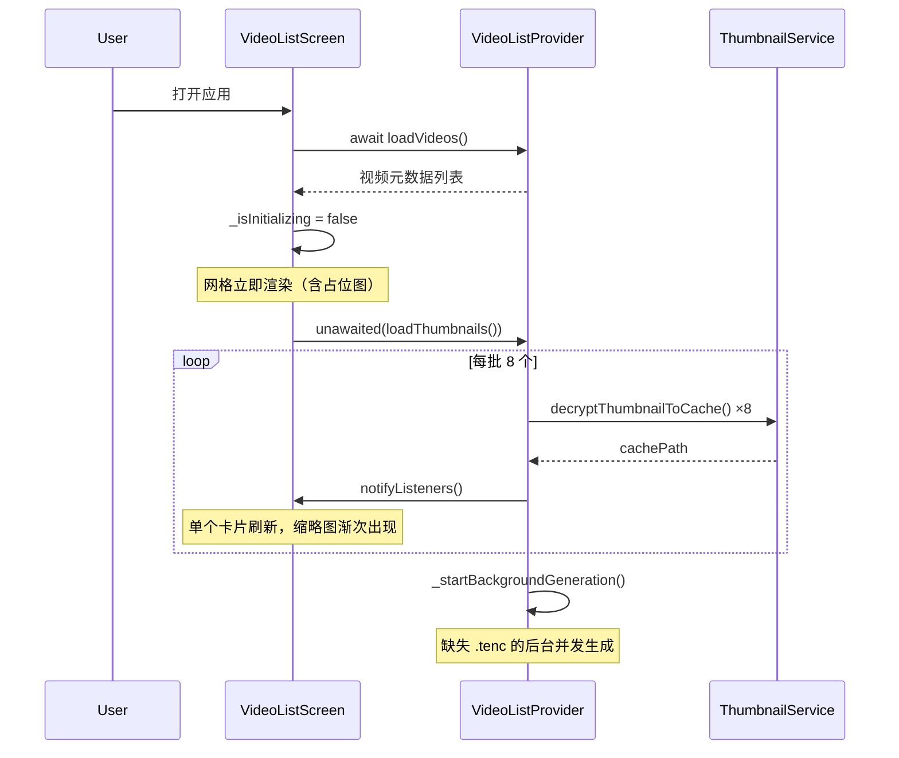

## 用户需求

列表缩略图生成速度慢，需要对现有流程进行深度优化，让视频列表快速展示、缩略图异步加载。

## 核心功能

- 消除启动时的白屏等待：视频列表先展示（含占位图），缩略图后台异步加载，不阻塞 UI 渲染
- 降低缩略图编码开销：调整 JPEG 质量和分辨率到合理平衡点，减少文件体积和 I/O 时间
- 加快缩略图加载吞吐：增大批处理数量、消除同步 I/O 调用、后台生成引入有限并发

## 技术栈

- Flutter (Dart 3.1+) + Provider 状态管理
- video_thumbnail 插件提取视频帧
- AES-256-CTR 加密（pointycastle）
- SendPort/ReceivePort Isolate 通信

## 实现方案

### 整体策略

围绕四个维度并行优化，每个维度独立且可叠加收益：

**维度一：参数调优（最小改动，即刻生效）**

- `thumbnailQuality`: 95 → 60。480×270 分辨率下 JPEG 画质 60 与 95 肉眼不可区分，但文件体积减少约 60-70%
- `thumbnailBatchSize`: 3 → 8。加载已有 .tenc 缓存时加大并发度，30 个视频从 10 批降至 4 批
- 缩略图加载超时从 10s 降至 5s（已有 .tenc 的缓存解密毫秒级完成，10 秒是浪费）

**维度二：消除初始化阻塞（架构改动）**

- `video_list_screen.dart:_initApp()` 将 `await videoProvider.loadThumbnails()` 改为非阻塞：

1. 先 `await videoProvider.loadVideos()` → 设置 `_isInitializing = false`（网格立即可见）
2. 再 `unawaited(videoProvider.loadThumbnails())`（后台加载缩略图，一条一条冒出）

- VideoCard 在 `thumbCachePath == null` 时渲染占位图（已有逻辑），无需等待

**维度三：优化 VideoCard 同步 I/O**

- 移除 `File(video.thumbCachePath!).existsSync()`，改为：
- `loadThumbnails()` 成功时设置 `thumbCachePath` 为非 null 字符串即为有效
- `deleteVideo()` 清理时置 `thumbCachePath = null`
- VideoCard 仅检查 `video.thumbCachePath != null`（内存判断，零 I/O）
- 兜底方案：Image.file 的 `errorBuilder` 已覆盖文件不存在的降级渲染

**维度四：后台生成引入有限并发**

- `_startBackgroundGeneration()` 从逐条串行改为 2 并发池：
- 创建固定大小的并发槽位（`_concurrencyLimit = 2`）
- 每完成一个立即启动下一个，保持 2 个 Isolate 同时运行
- 间隔从 300ms 降至 50ms（并发池已通过槽位控制资源，间隔只需让出事件循环）
- 保持现有的 `_thumbnailToken` 取消机制和 `notifyListeners` 刷新节奏

### 维度二详细设计

### 性能收益预估

| 优化项 | 改动量 | 收益 |
| --- | --- | --- |
| JPEG 质量 95→60 | 1 行 | 文件体积 ~60%，I/O 和内存同步缩减 |
| 批处理 3→8 | 1 行 | 已有缓存加载吞吐 ×2.7 |
| 消除 init 阻塞 | ~10 行 | 白屏时间从 100s 降至 0（网格即时可见） |
| 移除 existsSync | ~5 行 | 消除每次 build 的同步磁盘 I/O |
| 2 并发后台生成 | ~40 行 | 缺失缩略图生成速度 ×2 |
| **合计** | **~60 行** | **启动体验从不可用 → 秒开，整体吞吐量 5-10×** |

## 实现注意事项

### 性能

- VideoCard build 方法中不执行任何 I/O 操作（`existsSync` 移除是 key change）
- `loadThumbnails()` 分批后 `await Future.delayed(Duration.zero)` 让出主线程，保证动画帧不被阻塞
- 后台并发池上限 2 是基于 Isolate 开销考量：每个 Isolate 需要独立内存空间，移动端超过 2 个可能触发内存压力

### 日志

- 沿用现有 `debugPrint('[SnPlayer] ...')` 模式
- 并发池启动/完成时打印槽位使用情况，便于排查拥塞

### 兼容性

- VideoItem.thumbCachePath 语义不变：null = 未加载，非 null = 已缓存
- VideoCard 的占位图逻辑已存在，仅移除 existsSync 检查
- 现有错误处理（errorBuilder、try-catch）全部保留