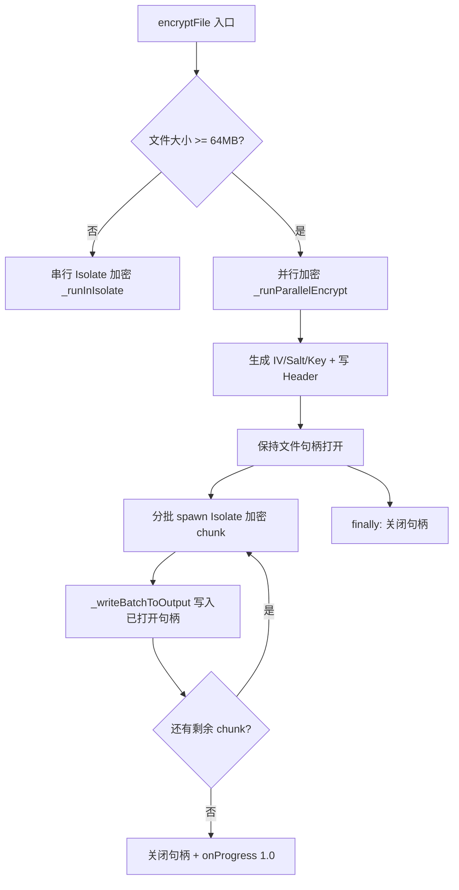

## 用户需求

当前 SnPlayer 加密视频使用单线程（串行 Isolate），速度较慢。项目中已存在多线程（并行 Isolate）加密路径 `encryptFileParallel`，但其产物文件头版本字节（偏移 32）为 0x00 而非 0x02，导致播放器/解密校验版本号时失败，已被强制禁用。用户希望修复此 bug 并启用多线程加密提速。

## 产品概述

修复并行加密/解密中 `_writeBatchToOutput` 使用 `FileMode.write` 导致文件被截断的 bug，使并行加密产物格式正确（版本号 0x02），并让 `encryptFile` 根据文件大小自动选择串行/并行路径，提升大文件加密速度。

## 核心功能

- 修复 `_writeBatchToOutput` 截断 bug：改为接收已打开的文件句柄，避免重复打开截断
- 修复 `_runParallelEncrypt` 和 `_runParallelDecrypt`：保持输出文件句柄在整个并行流程中打开，用 try/finally 保证异常时关闭
- `encryptFile` 自动选择路径：文件 >= 64MB 走并行加密，否则串行（参照 `decryptToTemp` 现有逻辑）
- 更新 CODEBUDDY.md 文档，移除"并行加密不应启用"的警告

## 技术栈

- 语言：Dart (Flutter)
- 加密：AES-256-CTR + PBKDF2-HMAC-SHA256（PointyCastle）
- 并发模型：Isolate（Dart 独立线程），分批启动 + 并发上限控制
- 无新增依赖，纯修复现有代码

## 根因分析

### Bug 位置：`lib/services/crypto_service.dart` 第 473-500 行 `_writeBatchToOutput`

```
// 当前代码（有 bug）
static Future<void> _writeBatchToOutput(...) async {
  final outputRaf = File(outputPath).openSync(mode: FileMode.write); // FileMode.write = O_TRUNC！
  // ... 写入各 chunk ...
  outputRaf.closeSync();
}
```

Dart 的 `FileMode.write` 等价于 `O_WRONLY | O_CREAT | O_TRUNC`，**会截断已存在的文件**。

### 并行加密 bug 链（`_runParallelEncrypt` 第 507-603 行）

1. 第 5 步（537-545行）：用 `FileMode.write` 打开输出文件，写入 64 字节 header（`header[32] = 0x02`）+ 预分配文件大小，**关闭文件**
2. 第 6 步：各 Isolate 加密 chunk → 临时文件
3. 调用 `_writeBatchToOutput`：用 `FileMode.write` 重新打开输出文件 → **截断！header 被清空为全零** → 然后 `setPositionSync(headerSize + startOffset)` 写入密文
4. 结果：文件头偏移 32 处版本号从 0x02 变成 0x00

### 附带 bug：多批次截断

`parallelDecryptMaxConcurrency = 2`（config/crypto.dart:98）。当 `isolateCount > 2`（256MB+ 文件，isolateCount=4 或 6）时，`_writeBatchToOutput` 会被多次调用，每次截断，导致**前一批 chunk 数据也全部丢失**。并行解密 `_runParallelDecrypt` 共享同一方法，同样受影响。

## 实现方案

核心思路：**让输出文件句柄在整个并行流程中保持打开，各批次复用同一句柄写入，避免重复打开截断。**

### 改动 1：`_writeBatchToOutput`（crypto_service.dart:473-500）

- 签名改为接收 `RandomAccessFile outputRaf`（已打开的句柄），不再自己 open/close
- 移除 `File(outputPath).openSync(mode: FileMode.write)` 和 `outputRaf.closeSync()`
- 方法变为纯写入逻辑，生命周期由调用方管理

### 改动 2：`_runParallelEncrypt`（crypto_service.dart:507-603）

- 第 5 步：打开文件写 header + 预分配后，**句柄不关闭**，保持打开
- 第 6 步：每批 Isolate 完成后，用保持的句柄调 `_writeBatchToOutput(outputRaf, ...)`
- 用 `try/finally` 保证异常时也关闭句柄
- 最终 `onProgress?.call(1.0)` 在 finally 块后执行

### 改动 3：`_runParallelDecrypt`（crypto_service.dart:362-470）

- 同改动 2，第 4 步预分配后保持句柄打开
- 各批次复用句柄调 `_writeBatchToOutput`
- `try/finally` 保护句柄关闭

### 改动 4：`encryptFile`（crypto_service.dart:40-51）自动选择路径

- 参照 `decryptToTemp`（203-223行）现有逻辑
- 检测文件大小：>= `parallelDecryptMinFileSize`（64MB）走 `encryptFileParallel`，否则串行
- 调用方 `video_list_provider.dart:94` 的 `CryptoService.encryptFile(...)` 无需改动，透明升级
- 保留 `encryptFileParallel` 公开方法不变（已被外部引用）

### 改动 5：更新 CODEBUDDY.md

- 移除"并行加密代码保留但不应启用"的警告段落
- 更新为：并行加密已修复并自动启用，文件 >= 64MB 自动走并行路径

## 实现注意事项

- **文件句柄生命周期**：`_runParallelEncrypt` 和 `_runParallelDecrypt` 中，输出文件句柄必须在 `try` 块中打开，`finally` 块中关闭。避免 Isolate 异常或超时导致句柄泄漏。
- **`_writeBatchToOutput` 内部 setPositionSync 安全性**：每个 chunk 写入前调用 `setPositionSync(writeOffsets[i])` 定位到正确偏移，保持不变。由于不再截断，已写入的 header 和前批 chunk 数据不受影响。
- **性能影响**：串行加密 64MB 以下文件无变化；64MB 以上文件自动获得 2-6 路并行加速，预期提速 1.5x-3x（受 I/O 瓶颈和 Isolate 启动开销影响）。
- **向后兼容**：`encryptFileParallel` 公开接口签名不变，只是内部 bug 被修复。之前用串行路径加密的文件格式正确，不受影响。
- **不执行 `flutter build`**：修改后由用户自行验证。

## 架构设计

修改范围限定在 `crypto_service.dart` 单文件内的 3 个方法 + `encryptFile` 入口方法，不涉及跨层改动，符合项目分层架构。



## 目录结构

```
lib/services/crypto_service.dart   # [MODIFY] 核心修复 — 4 处改动：
                                   #   1. _writeBatchToOutput: 改为接收 RandomAccessFile 参数，不再 open/close
                                   #   2. _runParallelEncrypt: 保持句柄打开 + try/finally 保护
                                   #   3. _runParallelDecrypt: 保持句柄打开 + try/finally 保护
                                   #   4. encryptFile: 自动选择串行/并行路径
CODEBUDDY.md                       # [MODIFY] 更新文档 — 移除并行加密警告，更新为已修复自动启用
```

## 关键代码结构

修复后的 `_writeBatchToOutput` 签名变更：

```
/// 将一批临时块文件按各自偏移写入已打开的输出文件句柄
///
/// 调用方负责打开和关闭 [outputRaf]，避免 FileMode.write 截断已写入的数据。
static Future<void> _writeBatchToOutput(
  RandomAccessFile outputRaf,
  List<String> tempPaths,
  List<int> writeOffsets,
) async {
  final copyBuf = Uint8List(bufferSize);
  for (int i = 0; i < tempPaths.length; i++) {
    final chunkFile = File(tempPaths[i]);
    final raf = chunkFile.openSync(mode: FileMode.read);
    try {
      outputRaf.setPositionSync(writeOffsets[i]);
      int bytesRead;
      do {
        bytesRead = raf.readIntoSync(copyBuf);
        if (bytesRead > 0) {
          outputRaf.writeFromSync(copyBuf, 0, bytesRead);
        }
      } while (bytesRead == bufferSize);
    } finally {
      raf.closeSync();
    }
  }
}
```

修复后 `encryptFile` 自动选择路径：

```
static Future<void> encryptFile(
  String inputPath,
  String outputPath, {
  void Function(double)? onProgress,
}) async {
  final fileSize = await File(inputPath).length();
  if (fileSize >= parallelDecryptMinFileSize) {
    await encryptFileParallel(inputPath, outputPath, onProgress: onProgress);
  } else {
    await _runInIsolate(
      command: 'encrypt',
      inputPath: inputPath,
      outputPath: outputPath,
      onProgress: onProgress,
    );
  }
}
```