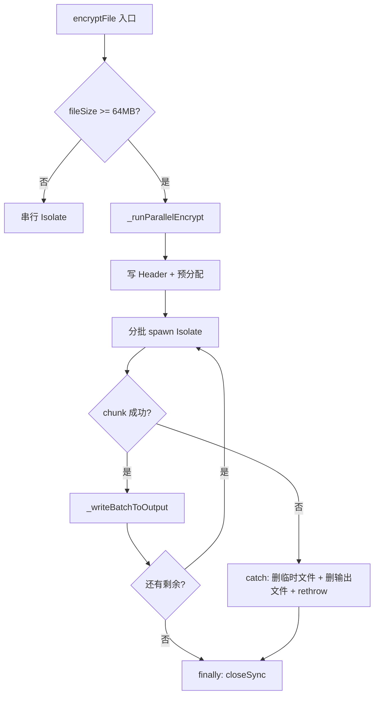

## 产品概述

对 SnPlayer 加密功能代码进行全面审查，修复发现的逻辑漏洞、一致性问题、代码冗余，并实施加速优化方案。

## 核心功能

### 高优逻辑漏洞修复

- **并行失败时临时 chunk 文件残留**：chunk Isolate 异常后，`$outputPath.chunk_$i.tmp` 不清理，重试时残留干扰
- **并行失败时输出文件残留**：损坏的输出文件残留在磁盘，调用方不知情，应在异常时删除
- **并行进度回调非单调跳变**：两个 chunk 并发执行，进度值交错跳变（0.3→0.05→0.35→0.1），用户体验差

### 中优一致性修复

- **PBKDF2 迭代次数注释严重错误**：config 注释写"1 万次"、crypto_service 注释写"100K 迭代"、CODEBUDDY.md 写"100,000 次"，实际仅 10 次
- **decryptFile 未自动选路**：`decryptFile` 始终串行，与 `encryptFile` 自动选路行为不一致
- **class doc 过时**：写"2-4 路"实际 2-6 路，且未提及加密自动并行

### 低优代码冗余消除

- `_spawnEncryptChunkIsolate` 和 `_spawnChunkIsolate` 约 60 行结构完全相同，仅命令名和 writeOffset 不同
- `_encryptChunkInIsolate` 和 `_decryptChunkInIsolate` 约 80 行结构相同，仅 fileStartOffset 计算不同

### 加速优化

- 去掉 `encryptFile` 和 `_runParallelEncrypt` 重复的 `File(inputPath).length()` 调用
- 移除每批 chunk 完成后多余的 `Future.delayed(Duration.zero)`

## Tech Stack

- 语言：Dart (Flutter)
- 加密：AES-256-CTR + PBKDF2-HMAC-SHA256（PointyCastle）
- 并发模型：Isolate，分批启动 + 并发上限控制
- 无新增依赖，纯修复现有代码

## Implementation Approach

### 漏洞 1+2 修复：并行失败资源清理（crypto_service.dart）

在 `_runParallelEncrypt` 和 `_runParallelDecrypt` 中，将 try/finally 结构改为 try/catch/finally：

- **catch 块**：收集所有已生成的临时 chunk 文件路径（包括 pendingFutures 对应的 chunkTempPaths + 循环中已 add 但未处理的），逐个删除；删除输出文件；rethrow 异常
- **finally 块**：仅负责关闭 outputRaf

具体实现：在 catch 中遍历当前已知的 chunkTempPaths 删除临时文件，再尝试删除 outputPath 本身（可能已部分写入），最后 rethrow。注意 catch 中删除文件也要 try-catch 包裹，避免清理本身抛异常掩盖原始错误。

### 漏洞 3 修复：进度回调单调化（crypto_service.dart）

在 `_runParallelEncrypt` 和 `_runParallelDecrypt` 中维护一个 `double maxProgress = 0.0` 变量。`_spawnEncryptChunkIsolate`/`_spawnChunkIsolate` 的 onProgress 回调改为先计算 `newProgress = (chunkIndex + value) / totalChunks`，然后 `maxProgress = math.max(maxProgress, newProgress)`，只回调 maxProgress。

这保证进度值单调递增，即使两个 chunk 并发交错执行，用户看到的进度始终递增。需要 `import 'dart:math'` 或使用 `maxProgress = newProgress > maxProgress ? newProgress : maxProgress` 避免 import。

### 问题 4 修复：PBKDF2 注释统一（config/crypto.dart, crypto_service.dart, CODEBUDDY.md）

- `config/crypto.dart:28-29`：注释从"v2: 1 万次"改为"v2: 10 次（固定密码场景，安全性靠密码本身强度，减少派生开销）"
- `crypto_service.dart:22`：注释从"100K 迭代开销"改为"10 次迭代开销"
- `crypto_service.dart:804`：注释从"100K 迭代"改为"10 次迭代"
- `CODEBUDDY.md`：从"100,000 次迭代"改为"10 次迭代"

### 问题 5 修复：decryptFile 自动选路（crypto_service.dart）

参照 `encryptFile`（48-58行）现有逻辑，在 `decryptFile`（81-92行）中添加文件大小检测：

- 读取 inputPath 文件大小
- >= `parallelDecryptMinFileSize`（64MB）走 `decryptFileParallel`
- 否则走 `_runInIsolate`

### 问题 6 修复：class doc 更新（crypto_service.dart:19）

从"大文件（≥64MB）自动启用 2-4 路并行分块解密"改为"大文件（≥64MB）自动启用 2-6 路并行分块加解密"

### 重复 7 消除：合并 _spawnEncryptChunkIsolate 和 _spawnChunkIsolate（crypto_service.dart）

合并为通用方法 `_spawnChunkIsolateGeneric`，参数增加 `String command`（'encrypt_chunk' 或 'decrypt_chunk'）和可选的 `int? writeOffset`。内部 message 构建时根据 command 决定是否包含 writeOffset。约减少 50 行重复代码。

### 重复 8 消除：合并 _encryptChunkInIsolate 和 _decryptChunkInIsolate（crypto_isolate.dart）

合并为通用方法 `_processChunkInIsolate`，参数增加 `bool isDecrypt`。fileStartOffset 计算时 `isDecrypt ? headerSize + startOffset : startOffset`。约减少 70 行重复代码。

### 加速 1：去掉重复 stat 调用（crypto_service.dart）

`encryptFile`（48行）已调用 `File(inputPath).length()` 获取 fileSize，传给 `encryptFileParallel` → `_runParallelEncrypt`。`_runParallelEncrypt` 内部（542行）不再重复调用，改为接收 fileSize 参数。`encryptFileParallel` 签名增加可选 `int? fileSize` 参数，内部传入。

### 加速 2：移除多余 Future.delayed（crypto_service.dart）

删除 `_runParallelDecrypt`（468行）和 `_runParallelEncrypt`（607行）中每批 chunk 完成后的 `await Future.delayed(Duration.zero)`。`Future.wait` 和 `_writeBatchToOutput` 内部的 `await` 已提供事件循环让出点。

## Implementation Notes

- **资源清理顺序**：catch 块中先删临时文件再删输出文件，最后 rethrow。删除操作用 try-catch 包裹避免掩盖原始异常。
- **进度单调化**：使用条件表达式 `maxProgress = newProgress > maxProgress ? newProgress : maxProgress` 替代 `math.max`，避免新增 import。
- **decryptFile 自动选路**：注意 `decryptToTemp` 已有选路逻辑且调用了 `decryptFileParallel`，修改 `decryptFile` 后 `decryptToTemp` 的选路变为冗余但无害（decryptFile 内部会再次判断，parallelDecryptMinFileSize 相同所以结果一致）。可选保留 decryptToTemp 的选路作为显式标记，或简化 decryptToTemp 直接调 decryptFile。
- **合并 _spawnChunkIsolate**：注意加密 chunk 不需要 writeOffset 参数，解密 chunk 需要。合并后 writeOffset 设为可选参数，仅 decrypt_chunk 命令时传入 message。
- **Blast radius**：所有修改不影响加密文件格式，不影响已加密文件的兼容性。`encryptFileParallel` 和 `decryptFileParallel` 公开接口签名变化（增加可选参数），向后兼容。

## Architecture Design

修改范围限定在 `crypto_service.dart`、`crypto_isolate.dart`、`config/crypto.dart` 三个文件，不涉及跨层改动。



## Directory Structure

```
lib/services/crypto_service.dart   # [MODIFY] 核心修复 — 漏洞 1-3、问题 5-6、加速 1-2、重复 7
                                   #   1. _runParallelEncrypt/Decrypt: catch 块清理临时文件+输出文件
                                   #   2. _runParallelEncrypt/Decrypt: maxProgress 单调进度
                                   #   3. decryptFile: 自动选路 (>=64MB 并行)
                                   #   4. class doc 更新
                                   #   5. _runParallelEncrypt: 接收 fileSize 参数避免重复 stat
                                   #   6. 移除 Future.delayed(Duration.zero)
                                   #   7. 合并 _spawnEncryptChunkIsolate + _spawnChunkIsolate
                                   #   8. 注释修正 (PBKDF2 迭代次数)
lib/services/crypto_isolate.dart   # [MODIFY] 合并 _encryptChunkInIsolate + _decryptChunkInIsolate
                                   #   为通用 _processChunkInIsolate(isDecrypt: bool)
lib/config/crypto.dart             # [MODIFY] 注释修正 — pbkdf2Iterations 注释从"1万次"改为"10次"
CODEBUDDY.md                       # [MODIFY] 文档修正 — PBKDF2 迭代次数 + 加解密并行描述
```