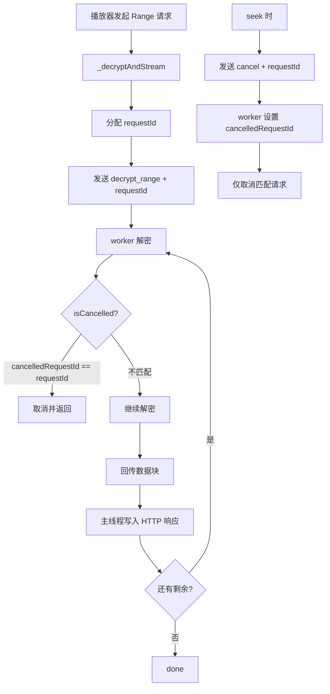

## 产品概述

对 SnPlayer 播放解密代码进行全面审查，修复发现的内存泄露、逻辑漏洞、冗余代码，提升播放稳定性和资源管理可靠性。

## 核心功能

### 高优修复

- 修复 `_initWithProxy` 失败后 VideoPlayerController 未 dispose 导致的原生资源泄露
- 修复 worker Isolate 中 `cancelled` 全局标志共享导致的并发竞态问题

### 中优修复

- 修复 `_playExternal` NO_PLAYER 分支未清理 `_externalProxy` 的资源泄露
- 移除 `stop()` 中冗余的 `send('stop')` 调用
- 修复 `_playExternalFallback` 可能叠加或误关 loading dialog 的问题

### 低优优化

- dispose 中 `_proxy.stop()` 使用 `unawaited()` 明确意图

## Tech Stack

- 语言：Dart (Flutter)
- 播放器：video_player（ExoPlayer）
- 加密：AES-256-CTR + PBKDF2（PointyCastle）
- 并发：Isolate + HttpServer 本地代理
- 无新增依赖

## Implementation Approach

### 修复 1：_controller 泄露（video_player_screen.dart）

在 `_initWithProxy` 方法中，将 `_controller` 的创建和 `initialize`/`play` 包裹在 try-catch 中。catch 块内先 `_controller?.dispose()` 再置 null，确保异常时 ExoPlayer 原生资源被释放。同时在外层 catch 块（阶段 2 降级阶段 3）也补充 `_controller?.dispose()` 清理。

具体改动：

- `_initWithProxy` 内部添加 try-catch，catch 中 dispose controller
- 外层 `_initPlayer` 阶段 2 catch 块补充 `_controller?.dispose(); _controller = null;`

### 修复 2：worker cancelled 竞态（streaming_decrypt_proxy.dart）

将全局 `cancelled` 布尔值改为**按请求 ID 跟踪**的取消机制。每个 `decrypt_range` 请求分配唯一 ID，cancel 命令携带目标 ID，worker 只取消匹配 ID 的请求。

具体方案：

- worker 入口维护 `int _currentRequestId = 0` 和 `int? _cancelledRequestId`
- `decrypt_range` 消息携带 `requestId`（主线程生成递增 ID）
- `cancel` 消息携带 `requestId`，worker 设置 `_cancelledRequestId = requestId`
- `_decryptRangeInWorker` 的 `isCancelled` 回调改为 `() => _cancelledRequestId == requestId`
- 不再在 `decrypt_range` 开始时重置 `cancelled = false`，避免影响其他请求

主线程改动：

- `StreamingDecryptProxy` 新增 `int _nextRequestId = 0` 递增计数器
- `_decryptAndStream` 中发送 `decrypt_range` 时附带 `requestId`
- 发送 `cancel` 时附带当前 `requestId`

### 修复 3：_externalProxy NO_PLAYER 清理（video_list_screen.dart）

在 `_playExternal` 的 `NO_PLAYER` 分支（第 523-529 行）中，return 前添加 `await _externalProxy?.stop(); _externalProxy = null;`

### 修复 4：stop() 冗余 send（streaming_decrypt_proxy.dart）

删除 `stop()` 中第 139 行 `_workerSendPort?.send({'type': 'stop'})`，因为下一行 `kill(immediate)` 会立即终止 Isolate，消息永远不被处理。

### 修复 5：loading dialog 安全性（video_list_screen.dart）

将 loading dialog 的 push 和 pop 改为使用 `NavigatorState` 句柄管理，确保 pop 只关闭 loading dialog 而非其他路由。或者更简单的方案：在 `_playExternal` 开始时记录 loading dialog 是否已展示，catch 中只在已展示时 pop，fallback 内部检查是否已有 loading 在展示。

采用更简单方案：将 showDialog 的 pop 逻辑统一为检查 `_externalProxy` 是否已创建来判断当前处于哪个阶段，避免误 pop。但最可靠的方式是使用 `Navigator.popUntil` 配合路由判断或直接传 dialog context。

最终采用：将 loading dialog 移到 `_playExternal` 最外层统一管理，不在 fallback 内部单独展示。fallback 改为不展示 dialog（调用方已展示或在 catch 中展示）。

### 修复 6：dispose unawaited（video_player_screen.dart, video_list_screen.dart）

将 `_proxy!.stop()` 改为 `unawaited(_proxy!.stop())`，需添加 `import 'dart:async'`（如未导入）。

## Implementation Notes

- **cancelled 竞态修复**：主线程需要维护 requestId 计数器。每个 `_decryptAndStream` 调用分配唯一 ID，seek 时 cancel 携带该 ID。worker 侧 isCancelled 检查 `_cancelledRequestId == currentRequestId`。这保证并发请求互不干扰，seek 只取消旧请求。
- **_controller 泄露**：VideoPlayerController 内部持有 ExoPlayer 原生实例，不 dispose 会导致原生 SurfaceView/MediaCodec 泄露。多次降级后累积泄露可致 OOM。
- **Blast radius**：所有修改不影响加密文件格式和播放器接口。worker 通信协议变化（新增 requestId 字段）仅限 streaming_decrypt_proxy.dart 内部，不影响外部调用方。
- **性能**：修复 2 消除竞态后，并发 Range 请求不再互相干扰，播放流畅度提升。修复 1 消除原生资源泄露，长时间使用不再 OOM。

## Architecture Design

修改集中在 3 个文件，不涉及跨层改动：



## Directory Structure

```
lib/services/streaming_decrypt_proxy.dart   # [MODIFY] 核心 — worker cancelled 竞态修复 + stop 冗余清理
                                             #   1. 新增 _nextRequestId 计数器
                                             #   2. _decryptAndStream 传 requestId
                                             #   3. cancel 消息携带 requestId
                                             #   4. worker: cancelled 改为 requestId 匹配
                                             #   5. stop() 移除冗余 send('stop')
lib/screens/video_player_screen.dart         # [MODIFY] _controller 泄露修复 + unawaited
                                             #   1. _initWithProxy try-catch dispose controller
                                             #   2. _initPlayer 阶段 2 catch 补充 dispose
                                             #   3. dispose unawaited(_proxy.stop())
lib/screens/video_list_screen.dart           # [MODIFY] _externalProxy 清理 + dialog 修复 + unawaited
                                             #   1. NO_PLAYER 分支清理 _externalProxy
                                             #   2. loading dialog 统一管理
                                             #   3. dispose unawaited(_externalProxy.stop())
```

## Key Code Structures

修复后的 worker 取消机制核心接口：

```
// 主线程
class StreamingDecryptProxy {
  int _nextRequestId = 0;
  
  // _decryptAndStream 中
  final requestId = _nextRequestId++;
  _workerSendPort!.send({
    'type': 'decrypt_range',
    'requestId': requestId,
    'rangeStart': currentPos,
    'contentLength': remaining,
    'replyPort': replyPort.sendPort,
  });
  
  // seek 取消时
  _workerSendPort?.send({'type': 'cancel', 'requestId': requestId});
}

// worker
void _decryptWorkerEntry(SendPort mainPort) {
  int? _cancelledRequestId;
  
  receivePort.listen((message) async {
    if (type == 'cancel') {
      _cancelledRequestId = message['requestId'] as int;
      return;
    }
    if (type == 'decrypt_range') {
      final requestId = message['requestId'] as int;
      await _decryptRangeInWorker(
        ...,
        () => _cancelledRequestId == requestId,
      );
    }
  });
}
```