## 用户需求

播放加密视频时出现卡顿和掉帧现象，大文件（700MB+）尤为明显。需要优化流式解密代理的播放性能，消除卡顿。

## 问题概述

当前 `StreamingDecryptProxy._decryptAndStream` 方法在播放加密视频时存在多个性能瓶颈，导致大文件播放供数速率不足、主线程阻塞，引发掉帧和卡顿。

## 核心优化目标

- 消除逐块重建 cipher 对象的开销（最大瓶颈）
- 移除人为节流延迟，提升有效供数吞吐
- 减少不必要的内存拷贝，降低 GC 压力
- 保持 seek 回退和缓存命中路径的正确性

## 技术栈

- 框架：Flutter (Dart)
- 加密库：pointycastle ^3.7.3 (AES-256-CTR)
- 播放器：video_player ^2.8.0 (底层 ExoPlayer/MediaPlayer)
- 现有架构：本地 HTTP 代理服务器 + Range 请求按需流式解密

## 根因分析

### 瓶颈 1：每 512KB 块重建 cipher 对象（最严重）

`streaming_decrypt_proxy.dart` 第 336-337 行，每个 512KB 块都执行 `incrementCounter` + `createCtrCipher`。700MB 文件约 1400 块，每块都要：16 字节循环加法 + Uint8List 分配 + CTRStreamCipher/AESEngine 对象创建 + init。

**关键事实**：CTR 模式是流式加密，cipher 内部 counter 每处理 16 字节自动递增。PointyCastle 的 `CTRStreamCipher` 还会缓存不完整 16 字节块的剩余 keystream。因此，顺序播放时完全不需要重建 cipher——`processBytes` 连续调用即可，cipher 会自动保持在正确位置。

**佐证**：项目内 `crypto_isolate.dart`（第 246/335/434 行）已经是"创建一次 cipher → 多次 processBytes"的模式，说明 cipher 复用是本项目的既有实践。

### 瓶颈 2：每块 15ms 人为节流

第 387-390 行，burst 16 块（8MB）后每块额外等待 15ms。有效供数速率 ≈ 512KB / (25ms 解密 + flush + 15ms) ≈ 10MB/s。高码率或 seek 后缓冲重建时供不上 → 掉帧。

**关键事实**：`response.flush()` 已经提供 TCP 背压（等待数据写入 socket）。代理仅在收到 Range 请求时才响应数据，不会主动推送。播放器缓冲满后会停止发请求，不存在管道溢出风险。15ms 节流是冗余的双重保险。

### 瓶颈 3：每块双重内存拷贝

第 362 行 `Uint8List.fromList(procBuf.sublist(...))` 先 `sublist` 拷贝一次，再 `fromList` 拷贝一次。`response.add()` 内部还会拷贝到 socket 缓冲区。三重拷贝增加 GC 压力。

## 实现方案

### 核心策略：Per-Range-Request cipher 复用

在一个 `_decryptAndStream` 调用（即一个 Range 请求）内，所有 512KB 块是顺序的。仅在首个块创建 cipher（含 16 字节对齐 + skipBytes），后续块直接复用 cipher 的 `processBytes`，counter 自动递增。

**cipher 状态跟踪**：

- `cipher`：当前 StreamCipher 实例（nullable）
- `cipherPos`：cipher 已处理到的字节位置

**复用判定逻辑**：

- `cipher != null && cipherPos == currentPos` → 顺序续读，复用 cipher，skipBytes=0，不重新 setPosition（文件位置已由上次 readInto 推进）
- `cipher == null || cipherPos != currentPos` → seek 或缓存命中后断序，重建 cipher（对齐 + 调整 IV + setPosition）
- 缓存命中时设置 `cipher = null` 使下次 miss 重建

**对齐安全性**：首块 `readLen = skipBytes + chunkLen`（skipBytes < 16），buffer 扩展为 `_decryptBlockSize + aesBlockSize`（+16B）即可容纳。首块处理 `skipBytes + chunkLen` 字节后，cipher 恰好到达 `currentPos + chunkLen`，后续块 `skipBytes=0` 且 cipher 位置匹配。

### 节流移除

删除 `Future.delayed(throttleDelay)` 调用，保留 `response.flush()` 作为唯一背压机制。配置常量 `streamingThrottleDelayMs` 设为 0 保留兼容性。

### 缓冲拷贝优化

- 响应输出：`response.add(Uint8List.sublistView(procBuf, outputStart, bytesRead))` — 视图零拷贝，`add()` 内部单次拷贝
- 缓存存储：`procBuf.sublist(0, _decryptBlockSize)` — 单次拷贝（原代码双重拷贝）
- Buffer 大小：`_decryptBlockSize + aesBlockSize`（512KB + 16B）

## 实现注意事项

- **并发安全**：每个 Range 请求独立打开文件句柄、独立 cipher 状态，互不干扰
- **缓存命中兼容**：cache hit 时使 cipher 失效，下次 miss 自动重建，不影响正确性
- **末尾块处理**：最后一块可能非 512KB 整数倍，cipher 处理后不再复用，无影响
- **PointyCastle import**：需新增 `import 'package:pointycastle/api.dart';` 以使用 `StreamCipher` 类型
- **代码风格**：if 语句必须有花括号 `{}`
- **禁止构建**：修改后由用户自行验证，不执行 flutter build

## 架构设计

```mermaid
sequenceDiagram
    participant Player as ExoPlayer
    participant Proxy as StreamingDecryptProxy
    participant Cache as BlockCache (LRU)
    participant File as Encrypted File

    Player->>Proxy: GET /video (Range: bytes=100-2MB)
    
    rect rgb(40,40,40)
    Note over Proxy: 首块：创建 cipher (对齐+IV调整)
    Proxy->>File: setPosition(header + alignedStart)
    Proxy->>Cache: get(blockIndex) → miss
    Proxy->>File: readInto(buf, skipBytes+chunkLen)
    Proxy->>Proxy: cipher.processBytes (首次)
    Proxy-->>Player: flush() [skipBytes..end]
    end
    
    rect rgb(30,60,30)
    Note over Proxy: 后续块：复用 cipher (零创建开销)
    Proxy->>Cache: get(blockIndex) → miss
    Proxy->>File: readInto(buf, chunkLen) [位置已推进]
    Proxy->>Proxy: cipher.processBytes (复用, counter自增)
    Proxy-->>Player: flush() [0..end]
    end
    
    rect rgb(60,40,30)
    Note over Proxy: 缓存命中：cipher 失效, 内存直出
    Proxy->>Cache: get(blockIndex) → hit!
    Proxy-->>Player: flush() [blockOffset..end]
    Note over Proxy: cipher = null (下次 miss 重建)
    end
```



## 目录结构

```
lib/
├── services/
│   └── streaming_decrypt_proxy.dart  # [MODIFY] 核心优化：cipher 复用 + 移除节流 + 缓冲优化
└── config/
    └── crypto.dart                    # [MODIFY] streamingThrottleDelayMs 改为 0，更新注释
```

### 文件变更详情

**`lib/services/streaming_decrypt_proxy.dart`** [MODIFY]

- 新增 `import 'package:pointycastle/api.dart';`（StreamCipher 类型）
- 重构 `_decryptAndStream` 方法：
- 新增局部变量 `StreamCipher? cipher` + `int cipherPos = -1` 跟踪 cipher 状态
- Buffer 扩展：`Uint8List(_decryptBlockSize + aesBlockSize)`
- 缓存 miss 路径：判定 `cipherPos == currentPos` 决定复用或重建
- 缓存 hit 路径：设置 `cipher = null` 使下次 miss 重建
- 删除 `Future.delayed(throttleDelay)` 节流逻辑
- 响应输出改用 `Uint8List.sublistView` 替代 `Uint8List.fromList(sublist())`
- 缓存存储改用 `sublist()` 替代 `Uint8List.fromList(sublist())`
- `_BlockCache` 和 `_Range` 类不变

**`lib/config/crypto.dart`** [MODIFY]

- `streamingThrottleDelayMs`：15 → 0
- 更新注释说明：flush() 提供背压，人为节流已移除
- `streamingBurstBlocks`：保留常量但标注"已废弃，不再使用"